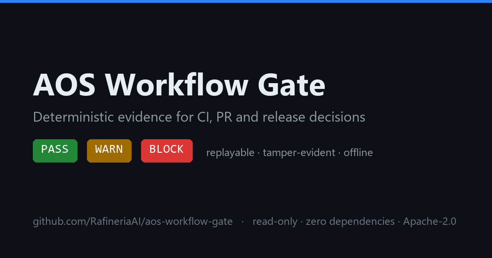
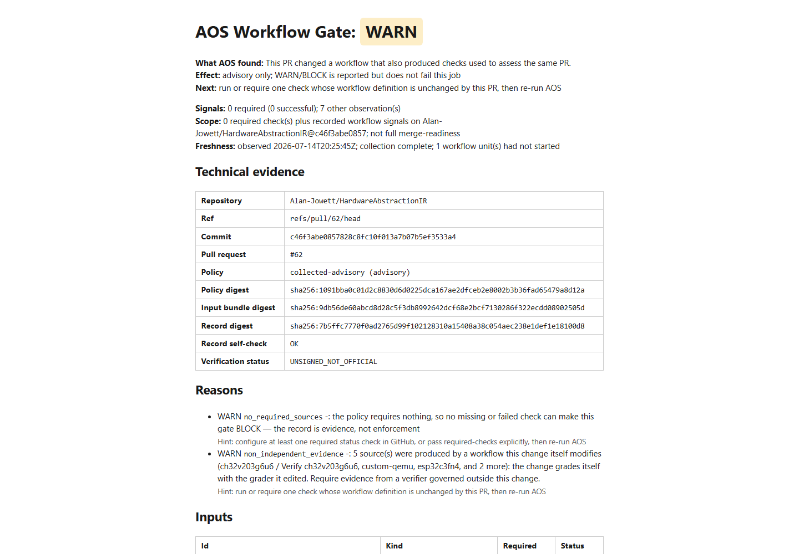

# aos-workflow-gate



[](https://github.com/RafineriaAI/aos-workflow-gate/actions/workflows/aos-workflow-gate-ci.yml)
[](https://github.com/RafineriaAI/aos-workflow-gate/actions/workflows/aos-workflow-gate-self.yml)
[](https://github.com/RafineriaAI/aos-workflow-gate/releases/latest)
[](LICENSE)

**GitHub can show green even when no check is required, or when a PR
changes the workflow that produced its own green checks.**

`aos-workflow-gate` is a read-only pre-merge control check. It compares
active branch requirements with the checks observed on the exact commit,
then returns `PASS`, `WARN`, or `BLOCK` with one plain-language reason
and one concrete next action.

Not another AI reviewer: AOS does not judge code or guess whether AI wrote
it. Existing tools produce check results. AOS checks whether the configured
merge controls actually ran and whether the decision can be reproduced.

```text
AOS Workflow Gate: WARN

What AOS found:
This PR changed a workflow that also produced checks used to assess
the same PR.

Effect:
Advisory only; this result does not fail the job.

Next:
Run or require one check whose workflow definition is unchanged by
this PR, then re-run AOS.
```



That is the product boundary: **required-check integrity for one exact
commit, not full merge-readiness and not another code review.**

## Daily use

- **Before requesting review:** run `check-pr` against a public PR and see
  whether required controls are missing, pending, failed, or unverifiable.
- **On every PR:** keep the Action advisory and get one visible diagnosis
  plus one `Next`, without changing the existing CI.
- **When a workflow changes:** detect when the PR also changes the workflow
  that produced its checks, then require an unchanged check before merge.
- **After the decision:** retain the exact-commit record so a maintainer can
  verify later what AOS saw and why it returned that verdict.

For an individual developer this reduces manual cross-checking before
review. For a team it makes the same repository rule produce the same
decision. For platform, security, and audit owners it preserves a bounded
record without uploading source code.

Try any public PR locally:

```bash
python -m pip install "git+https://github.com/RafineriaAI/aos-workflow-gate@v0.36.0"
aos-workflow-gate check-pr https://github.com/OWNER/REPO/pull/N
```

## First value in one PR

Self-Test Mode (zero-config) is an advisory check of the current pull
request. No manual policy, bundle, or `required-checks` list is needed.
The Action reads GitHub branch rules, check runs, workflow runs, and commit
statuses for the exact head commit. It writes the same diagnosis to the job
summary and saves the decision for offline verification.

This is a complete workflow file. Add it as
`.github/workflows/aos-self-test.yml`. No checkout is needed:

```yaml
name: AOS Self-Test

on:
  pull_request:

permissions:
  contents: read
  checks: read
  actions: read
  pull-requests: read
  statuses: read

jobs:
  self-test:
    runs-on: ubuntu-latest
    steps:
      # Pinned from actions/setup-python@v6 on 2026-07-03.
      - uses: actions/setup-python@ece7cb06caefa5fff74198d8649806c4678c61a1
        with:
          python-version: "3.11"
      - name: AOS self-test (advisory)
        uses: RafineriaAI/aos-workflow-gate@v0.36.0
```

A `permissions:` block sets every unlisted scope to `none`. Zero-config
uses `checks: read` for check runs, `actions: read` for workflow runs,
`pull-requests: read` for the SHA-bound changed-file set, and
`statuses: read` for legacy commit statuses. Public repositories may allow
unauthenticated reads; declare every scope so the same workflow works on
private repositories.

No `required-checks` input is needed: zero-config mode discovers the
required status checks from your branch rules (classic branch
protection included when the token can read it; an unreadable classic
surface is recorded as unverifiable, never interpreted as zero
requirements), enforces their app-bound identity, and waits
briefly for them to stabilize. Name `required-checks` only to
override the discovery; named checks become required (missing or
failed means `BLOCK`). Every other result stays in the record but does not
change the zero-config verdict; an explicit policy can promote it to a
warning. Set `wait-for-checks: "120"` to poll until the required checks
complete (only
required checks are waited for; a wait that ends incomplete fails closed
and is recorded in the bundle's collection status). The generated bundle
and policy are written to `.aos-gate/` so the decision stays replayable.
Workflows that never started are visible too: the gate reads the
commit's check suites and workflow runs, and anything still queued or
awaiting approval is recorded in the bundle instead of silently not
existing.

The job page is designed to make these facts quickly scannable: the verdict
(`PASS`, `WARN`, or `BLOCK`), the scope it covers (and expressly does
not), the freshness of the observation, the effect (advisory or
enforcing), the signal counts, at most three top gaps with one
dominant problem, and exactly one **Next** step. An enforceably clean
`PASS` is quiet — one screen, no tables. The
step exposes outputs for downstream jobs: `verdict`, `diagnosis`,
`next-action`, `can-block`, `record`, `record-digest`, and the
state counters (`required-total`, `required-successful`,
`required-missing`, `required-pending`, `required-unverifiable`,
`required-failed`, `advisory-warnings`).

**First diagnosis.** Before the first gate run, probe what your token,
environment, and target actually allow — read-only, with stable
diagnostic codes and remediation, and no verdict
(see [docs/PREFLIGHT.md](docs/PREFLIGHT.md)):

```bash
aos-workflow-gate preflight --pr https://github.com/OWNER/REPO/pull/N
```

**Your evidence.** The decision record, the collected bundle, the
generated policy, and a static `evidence.html` view land in
`.aos-gate/` and are uploaded as the `aos-gate-evidence` artifact
by default. GitHub artifacts expire per repository settings —
attach the files to a release for permanence (this repository
gates and attaches its own release evidence that way).

**Replay it.** Anyone holding the artifact can reproduce the
decision offline:

```bash
pip install "git+https://github.com/RafineriaAI/aos-workflow-gate@v0.36.0"
aos-workflow-gate verify --input gate-decision.json --bundle bundle.json
aos-workflow-gate summarize --input gate-decision.json --html --out evidence.html
```

**Enforce when ready.** Advisory mode never fails the job. When the
record shows the gate you want, set `mode: "enforce"` — a `BLOCK`
verdict then fails the step, on your terms.

## Public technical proof

The committed `PASS`, `WARN`, and `BLOCK` examples prove deterministic
evaluation, evidence integrity, and offline replay:
[PASS](examples/pr-evidence-record.json),
[WARN](examples/zero-required-record.json), and
[BLOCK](benchmarks/cases/v0110-incident-counterfactual/). Each artifact is
replayed by the test suite on every CI run.

### Claim boundary

**Pre-pilot validation:** deterministic evaluation, exact-commit binding,
tamper detection, and offline reproduction are tested. Daily usefulness,
low-noise performance in external teams, incident reduction, retention, and
willingness to pay are not yet independently validated.

The internal research status therefore remains
[`NO_GO`](benchmarks/value/ASSESSMENT.md) for efficacy, production, and
commercial claims. `FREE_SELF_SERVE_VALIDATION` means the Action and CLI are
available as a free advisory preview so external users can test those open
questions without an account or telemetry. The full protocol is in the
[Hybrid Value Gate](benchmarks/value/README.md).

## Current status

Phase 2: the local `evaluate` CLI and the advisory GitHub Action are implemented. Phase 3 has started: the zero-config GitHub check-runs collector is implemented, so the action can gate a pull request without any hand-written input. The gate turns collected signals plus an explicit policy into a deterministic `PASS`, `WARN`, or `BLOCK` decision record that is replayable and tamper-evident. SARIF and Scorecard file adapters and starter policy packs are implemented; the GitLab collector is planned next.

Decision records carry `UNSIGNED_NOT_OFFICIAL` verification status: they are structure- and replay-checkable, not an official signed verdict.

No production, compliance, signing, SLSA, or security-audit claim is made by this repository at this stage.

## Core idea

A normal CI dashboard tells you which checks passed. `aos-workflow-gate` is intended to answer a stricter question:

> Given this exact PR, policy, commit, and set of workflow signals, why did the release gate decide `PASS`, `WARN`, or `BLOCK`?

That turns gate behavior from a scattered set of green and red checks into a replayable decision record.

## Practical use case

A maintainer wants a release candidate to be blocked when required checks are missing, warned when non-blocking scanners report known risks, and passed only when required evidence is present.

Run the gate locally:

```bash
python -m pip install -e .
aos-workflow-gate evaluate \
  --input examples/github-pr-signal-bundle.json \
  --policy policies/default.yml \
  --out examples/gate-decision.json
```

This prints the verdict and writes a full decision record. For the committed example the verdict is `WARN`: the required check passed and one advisory scanner warning remains. The record preserves subject identity, policy identity and digest, input identities and digests, the explained reasons, and a self-digest for tamper detection. A committed copy is checked in at [examples/gate-decision.json](examples/gate-decision.json).

Verify a decision record has not been altered:

```bash
aos-workflow-gate verify \
  --input examples/gate-decision.json \
  --bundle examples/github-pr-signal-bundle.json
```

Instant merge-control check for any pull request URL. The read-only
observer that fetches the head SHA, the base branch's active rules, and
the head's check runs, then evaluates a policy generated from the rules'
required status checks (missing required checks fail closed to `BLOCK`;
non-required results stay in the record without changing the default
verdict; the bundle's `rules_digest` makes protection drift between two
records detectable):

```bash
aos-workflow-gate check-pr https://github.com/OWNER/REPO/pull/N
```


Render a record as Markdown (the same summary the GitHub Action posts):

```bash
aos-workflow-gate summarize --input examples/gate-decision.json
```

Export a verified record as an unsigned in-toto Statement and sign it with
your own keys (see [docs/DECISION_PREDICATE.md](docs/DECISION_PREDICATE.md)):

```bash
aos-workflow-gate export \
  --input examples/aos-kernel-gate-decision.json \
  --out gate-statement.json
cosign sign-blob --yes gate-statement.json \
  --output-signature gate-statement.sig
```

The draft input and policy files are [examples/github-pr-signal-bundle.json](examples/github-pr-signal-bundle.json) and [policies/default.yml](policies/default.yml).

## GitHub Action: full control

Further inputs: `mode: "enforce"` makes a `BLOCK` verdict fail the step
(default `advisory` never fails the job); `policy-pack: minimal-pr-gate`
selects a bundled starter policy (see
[docs/POLICY_PACKS.md](docs/POLICY_PACKS.md)); `upload-artifact` is
`"true"` by default and uploads the record, the `.aos-gate/` evidence,
and `evidence.html` as the `aos-gate-evidence` artifact, even when an
enforced `BLOCK` fails the evaluate step (set `"false"` to skip).

For full control, provide an explicit bundle and policy. The action is
read-only, needs no repository secrets, writes a Markdown summary to the job
page, and exposes the decision record for artifact upload:

```yaml
permissions:
  contents: read

steps:
  # Pinned from actions/checkout@v5 on 2026-07-03.
  - uses: actions/checkout@93cb6efe18208431cddfb8368fd83d5badbf9bfd
    with:
      persist-credentials: false
  # Pinned from actions/setup-python@v6 on 2026-07-03.
  - uses: actions/setup-python@ece7cb06caefa5fff74198d8649806c4678c61a1
    with:
      python-version: "3.11"
  - name: Run gate (advisory)
    id: gate
    uses: RafineriaAI/aos-workflow-gate@v0.36.0
    with:
      input: examples/github-pr-signal-bundle.json
  # Pinned from actions/upload-artifact@v7.0.1 on 2026-07-04.
  - name: Upload decision record
    uses: actions/upload-artifact@043fb46d1a93c77aae656e7c1c64a875d1fc6a0a
    with:
      name: gate-decision
      path: gate-decision.json
```

Advisory mode never fails the job; the verdict is reported in the step summary
and in the `verdict` output. Set `enforce: "true"` to make a `BLOCK` verdict
fail the step. This repository runs the action on itself in
[.github/workflows/aos-workflow-gate-self.yml](.github/workflows/aos-workflow-gate-self.yml).

## External availability

Free self-serve validation is open through the Apache-2.0 source, CLI, and
GitHub Action in advisory mode. It requires no account and collects no
telemetry. Feedback and evidence submission are opt-in through the
[feedback issue form](https://github.com/RafineriaAI/aos-workflow-gate/issues/new?template=feedback.yml).
Availability, installs, downloads, and unsolicited reactions are funnel
observations, not evidence of usefulness or market demand.

The [Value Gate](benchmarks/value/ASSESSMENT.md) remains `NO_GO` for efficacy
or value claims, production recommendations, and paid pilot intake.
[GUIDED_PILOT](docs/GUIDED_PILOT.md) and
[PILOT_PACKAGE](docs/PILOT_PACKAGE.md) are future engagement specifications,
not active offers.

## Platform neutrality

The gate core is platform-neutral: plain Python, zero runtime dependencies,
JSON in and out. GitHub Enterprise Server works out of the box, and GitLab
CI or Jenkins can run the same evaluation on an explicitly provided bundle —
see [docs/CI_INTEGRATIONS.md](docs/CI_INTEGRATIONS.md). Only the check-runs
collector and the Action are GitHub-specific by design.

## What this is

- A deterministic gate over workflow evidence.
- A policy and evidence layer for CI, PR, scanner, and AI-agent signals.
- A practical bridge between `aos-kernel` verdict semantics and real repository workflows.
- A GitHub Action and local CLI that run in advisory mode before they block anything.

## What this is not

- Not a claim that a repository is secure.
- Not a compliance certification system.
- Not a replacement for code review, testing, threat modeling, or release engineering.
- Not a runtime proof that workflow systems are correct.
- Not a signing or provenance authority.

## Documentation map
<details>
<summary>Open the full technical documentation index</summary>


- [Scope](docs/SCOPE.md) defines claim boundaries and non-goals.
- [Architecture](docs/ARCHITECTURE.md) defines the layers and what each phase implements.
- [Use cases](docs/USE_CASES.md) gives the first practical workflow scenarios.
- [Adoption guide](docs/ADOPTION_GUIDE.md) removes terminology and integration barriers.
- [Standards compatibility](docs/STANDARDS_COMPATIBILITY.md) maps planned integrations to SLSA, SPDX, CycloneDX, SARIF, in-toto, and OpenSSF Scorecard without claiming compliance.
- [Decision record predicate](docs/DECISION_PREDICATE.md) defines the in-toto Statement export and operator-key signing recipe.
- [CI integrations](docs/CI_INTEGRATIONS.md) covers GitHub Enterprise Server, GitLab CI, and generic shell usage.
- [Adapters](docs/ADAPTERS.md) defines the mechanical SARIF and Scorecard mapping contracts.
- [Source contract](docs/SOURCE_CONTRACT.md) defines the versioned `source-v0` contract for external adapters: identity-completeness invariant, policy-owned classification, import via file or stdin, no plugin runtime.
- [Agent action adapter](docs/AGENT_ACTION.md) defines the `agent-action-v0` contract binding an agent's intent, action, parameters, and base state into validated evidence — states, not approvals.
- [Benchmark harness](docs/BENCHMARK_HARNESS.md) defines the `benchmark-case-v0` recorded-case format and `bench-verify`: digest bindings, chronology, offline replay, and an explicit verified-vs-unverifiable boundary — the harness runs nothing.
- [Real-agent governance benchmark](benchmarks/README.md) records real agent changes from this repository's own history — a real `PASS`, a real green-but-incomplete `WARN`, and the v0.11.0 incident as a `BLOCK` counterfactual on real signals — each replayable offline, with the dogfooding boundary stated first.
- [Policy packs](docs/POLICY_PACKS.md) documents the starter policies under `policies/packs/`.
- [Trust](docs/TRUST.md) shows how to verify every claim yourself: read-only permissions, no telemetry, zero dependencies, tamper evidence, offline replay.
- [Buyer FAQ](docs/BUYER_FAQ.md) answers security reviewers: data flows, permissions, free vs paid, vendor risk, platform coverage.
- [Security readiness](docs/SECURITY_READINESS.md) documents the private-repo data model and implemented input hardening, each with a negative test.
- [User FAQ](docs/USER_FAQ.md) answers first-run questions and maps every failure symptom to its meaning and fix.
- [Preflight diagnostics](docs/PREFLIGHT.md) documents the read-only capability probes, the stable diagnostic code registry, and preflight's exit semantics.
- [Value](docs/VALUE.md) states what the gate is worth, only as far as the evidence reaches.
- [Value metrics](docs/VALUE_METRICS.md) counts operational friction from the committed case studies — no ROI arithmetic, by design.
- [Comparison](docs/COMPARISON.md) maps what branch protection, OPA/conftest, in-toto attestations, and the gate each answer — a capability matrix, not a ranking.
- [One-pager](docs/ONE_PAGER.md) is the technical summary and claim boundary.
- [Hybrid Value Gate](benchmarks/value/README.md) defines the evidence required before publication or external pilots.
- [Guided pilot](docs/GUIDED_PILOT.md) is a future engagement specification; intake is closed.
- [Funnel](docs/FUNNEL.md) defines the open free self-serve path and the still-closed guided or paid path.
- [Pilot package](docs/PILOT_PACKAGE.md) is the future evidence handover specification.
- [Marketplace listing](docs/MARKETPLACE_LISTING.md) holds draft copy; publication is blocked by the Value Gate.
- [Real-repository replay case study](docs/case-studies/aos-kernel-release-surface-replay.md) runs the gate on real workflow signals at a pinned commit and replays the committed decision offline.
- [Green, but incomplete](docs/case-studies/green-but-incomplete.md) is a historical explicit-policy example showing how a non-required skipped check can be promoted to a replayable `WARN`; current zero-config keeps it recorded but quiet.
- [Exact-SHA contrast](benchmarks/value/EXACT_CONTRAST.md) is the canonical public aha case: GitHub records zero required checks while AOS names a self-validating workflow and preserves replayable evidence.
- [Merge-ready with zero enforced evidence](docs/case-studies/zero-required-checks.md) is a historical explicit-policy case: failed checks remain visible in evidence while the single AOS `WARN` identifies the empty-policy gap.
- [Roadmap](ROADMAP.md) defines the phased plan.
- [Release governance](docs/RELEASE_GOVERNANCE.md) defines branch, ruleset, tag, and release policy.
- [Draft signal bundle](examples/github-pr-signal-bundle.json) and [draft policy](policies/default.yml) make the first use case concrete.
- [Security policy](SECURITY.md) defines responsible reporting boundaries.
- [Contributing](CONTRIBUTING.md) defines contribution expectations.

</details>

## Local check

Run the local hygiene checks with:

```bash
python -m ruff check .
python -m mypy
python -m pytest
python tools/check_public_surface.py
```

Or run only the public surface check with:

```bash
python tools/check_public_surface.py
```

This check validates the documentation index, bootstrap claim boundary, and draft example files. It is not a product audit.

## Relationship to aos-kernel

`aos-kernel` remains the minimal public kernel and formal surface. `aos-workflow-gate` is the operational layer that will adapt real workflow signals into a gate decision record. Kernel correctness claims do not automatically extend to this repository.

## License

Apache-2.0. See [LICENSE](LICENSE).

The license covers this repository's source code only. It grants no rights
to the "AOS", "AOS Kernel", or "RafineriaAI" names and marks, and no rights
to the separate proprietary AOS Core technology. See [NOTICE](NOTICE).
