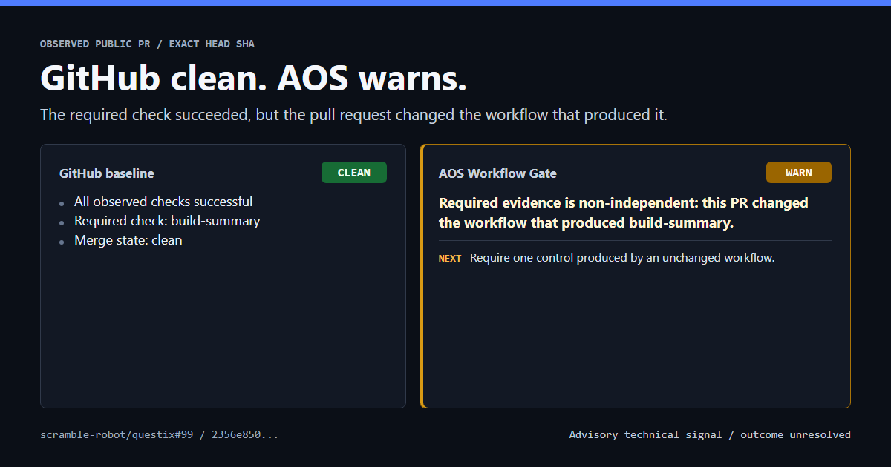
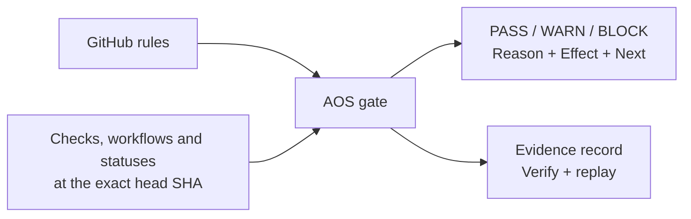

# AOS Workflow Gate

[](https://github.com/RafineriaAI/aos-workflow-gate/actions/workflows/aos-workflow-gate-ci.yml)
[](https://github.com/RafineriaAI/aos-workflow-gate/releases/latest)
[](LICENSE)

**Green checks can still miss a merge-control gap.**

AOS is a read-only control check for GitHub pull requests. It verifies which
merge controls actually ran for the exact head commit, then returns `PASS`,
`WARN`, or `BLOCK` with one reason, one next action, and replayable evidence.

**Read-only · Advisory by default · No source-code upload**

<picture>
  <source media="(max-width: 600px)" srcset="docs/assets/readme-contrast-mobile.png">
  
</picture>

Observed public case:
[`scramble-robot/questix#99`](https://github.com/scramble-robot/questix/pull/99).
GitHub reported `CLEAN` and successful checks. AOS linked the required
`build-summary` check to a workflow changed by the same PR. The outcome remains
unresolved; this is a verified technical contrast, not a defect or efficacy
claim. [Inspect the evidence and boundary](benchmarks/value/EXACT_CONTRAST.md).

## Try it on any public PR

```bash
python -m pip install "git+https://github.com/RafineriaAI/aos-workflow-gate@v0.36.0"
aos-workflow-gate check-pr https://github.com/OWNER/REPO/pull/N
```

The command is read-only and does not change the target repository. Anonymous
GitHub API limits may apply; provide a read-only token when needed.

## What AOS catches

- **A required control is not satisfied:** missing, pending, failed, or unverifiable
  evidence is named instead of disappearing behind an incomplete green view.
- **No status check is required:** branch rules were read successfully, but
  zero checks can enforce the merge.
- **A workflow assessed its own change:** the PR changed a workflow that
  produced evidence used to assess the same exact commit.

Not another AI reviewer: AOS does not judge code, generate review comments, or
guess whether AI wrote it. GitHub and CI produce signals. AOS checks whether
the configured controls produced independent, reproducible evidence.

The current product boundary is **required-check integrity for one exact
commit**, not full merge-readiness, security certification, or code review.

## First value in one PR

Add `.github/workflows/aos-self-test.yml`:

```yaml
name: AOS Self-Test

on:
  pull_request:

permissions:
  contents: read
  checks: read
  actions: read
  pull-requests: read
  statuses: read

jobs:
  self-test:
    runs-on: ubuntu-latest
    steps:
      # Pinned from actions/setup-python@v6 on 2026-07-03.
      - uses: actions/setup-python@ece7cb06caefa5fff74198d8649806c4678c61a1
        with:
          python-version: "3.11"
      - name: AOS self-test (advisory)
        uses: RafineriaAI/aos-workflow-gate@v0.36.0
```

No checkout, manual policy, bundle, or `required-checks` list is needed. The
Action reads branch rules, check runs, workflow runs, and commit statuses for
the exact head SHA. Every permission is read-only; listing all scopes also
keeps the workflow usable in private repositories, where unlisted scopes are
set to `none`.

The Action then:

1. discovers required controls and validates collection capability;
2. produces a plain-language verdict, dominant reason, effect, and `Next`;
3. saves the bundle, policy, decision record, and static HTML evidence view;
4. uploads them as the `aos-gate-evidence` artifact for offline replay.

This repository runs the same Action against itself in
[AOS Workflow Gate Self](.github/workflows/aos-workflow-gate-self.yml).

## A decision you can act on

```text
AOS Workflow Gate: WARN

Reason:
This PR changed the workflow that produced a required check.

Effect:
Advisory only; this result does not fail the job.

Next:
Require one check whose workflow definition is unchanged by this PR.
```

The verdict and the process exit code are separate. Advisory mode reports every
verdict but leaves the job successful. In `mode: "enforce"`, only `BLOCK`
fails the step. Teams can therefore observe noise before enabling enforcement.

## How it fits



AOS complements branch protection, CI, scanners, and review tools. It does not
replace them; it turns their observed signals and repository requirements into
one deterministic decision record.

## Daily value

- **Developer:** less manual cross-checking before requesting review and one
  named action when evidence is incomplete.
- **Team:** the same repository rule and the same inputs produce the same
  verdict, locally and in CI.
- **Platform, security, and audit:** exact-commit evidence can be retained and
  replayed without sending source code to RafineriaAI.

## Evidence and replay

The Action writes these files to `.aos-gate/`:

```text
bundle.json
policy.json
gate-decision.json
evidence.html
```

Verify the record and render the human-readable view offline:

```bash
aos-workflow-gate verify --input gate-decision.json --bundle bundle.json
aos-workflow-gate summarize --input gate-decision.json --html --out evidence.html
```

[Open an example WARN evidence report](docs/assets/aos-warn-evidence.png).
GitHub artifacts expire according to repository settings; attach evidence to a
release when it must remain durable.

Decision records currently carry `UNSIGNED_NOT_OFFICIAL`: their structure,
digests, subject binding, and replay can be verified, but they are not signed
RafineriaAI attestations.

## Adopt gradually

| Stage | Use | CI effect |
| --- | --- | --- |
| Local | `check-pr` before review | None |
| Advisory Action | Observe every PR and tune policy | Always succeeds |
| Enforced Action | Make a stable policy a required check | `BLOCK` fails |

Run capability diagnostics before troubleshooting a first integration:

```bash
aos-workflow-gate preflight --pr https://github.com/OWNER/REPO/pull/N
```

Preflight reports environment, permission, feature, and context readiness with
stable diagnostic codes. It never emits a policy verdict.

## Trust boundary

- The Action requests no write permission and needs no repository secret.
- No source code is uploaded to RafineriaAI; evaluation runs in your runner.
- No telemetry or account is required.
- No LLM participates in the verdict path.
- The Python package has zero runtime dependencies.
- A verdict does not prove that a repository is secure, defect-free, or
  compliant, and does not replace review, tests, or threat modeling.

See [Trust](docs/TRUST.md), [Security readiness](docs/SECURITY_READINESS.md),
and [Scope](docs/SCOPE.md) for the complete data and claim boundaries.

## Validation status

Mechanism verification and market validation are separate. Deterministic
evaluation, exact-commit binding, tamper detection, and offline replay are
covered by committed evidence and tests. Daily usefulness, alert precision in
external teams, incident reduction, retention, and willingness to pay are not
yet independently validated.

The Action and CLI are therefore available as a free advisory preview without
an account or telemetry. The formal research status remains
[`NO_GO`](benchmarks/value/ASSESSMENT.md) for efficacy, production, and
commercial claims; `FREE_SELF_SERVE_VALIDATION` permits external testing while
those claims remain closed. See the [Hybrid Value Gate](benchmarks/value/README.md).

Feedback is opt-in through the
[product feedback form](https://github.com/RafineriaAI/aos-workflow-gate/issues/new?template=feedback.yml).

## Documentation

- Start: [User FAQ](docs/USER_FAQ.md) and [Preflight](docs/PREFLIGHT.md).
- Configure: [Policy packs](docs/POLICY_PACKS.md) and
  [CI integrations](docs/CI_INTEGRATIONS.md).
- Verify: [Trust](docs/TRUST.md), [Security readiness](docs/SECURITY_READINESS.md),
  and [Decision predicate](docs/DECISION_PREDICATE.md).
- Understand: [Scope](docs/SCOPE.md), [Architecture](docs/ARCHITECTURE.md), and
  [Standards compatibility](docs/STANDARDS_COMPATIBILITY.md).
- Operate: [Release governance](docs/RELEASE_GOVERNANCE.md) and
  [Contributing](CONTRIBUTING.md).

## Local development

Run the local hygiene checks with:

```bash
python -m ruff check .
python -m mypy
python -m pytest
python tools/check_public_surface.py
```

Or run only the public surface check with:

```bash
python tools/check_public_surface.py
```

## License

Apache-2.0. See [LICENSE](LICENSE).

The license covers this repository's source code only. It grants no rights to
the "AOS", "AOS Kernel", or "RafineriaAI" names and marks, and no rights to the
separate proprietary AOS Core technology. See [NOTICE](NOTICE).
