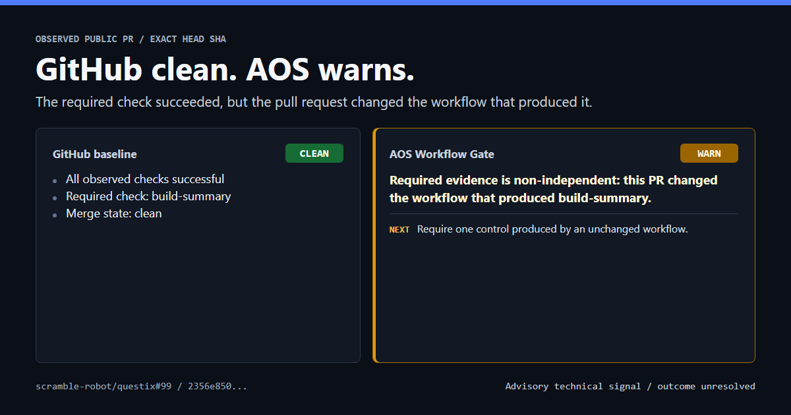

# AOS Workflow Gate

[](https://github.com/RafineriaAI/aos-workflow-gate/actions/workflows/aos-workflow-gate-ci.yml)
[](https://github.com/RafineriaAI/aos-workflow-gate/releases/latest)
[](LICENSE)

[English](#english) | [Polski](#polski)

## English

**AOS checks a project before code review or a release. It shows which checks
passed, what is missing, and what to do next.**

AOS works in two ways:

- **Local check:** finds standard build and test commands in the project and
  runs them. You do not need Git or prior knowledge of the commands.
- **GitHub pull-request check:** reads the repository's active requirements and
  compares them with the checks observed for the pull request's exact commit.

Each run returns `PASS`, `WARN`, or `BLOCK` and answers five questions: what is
wrong, why it matters, what is affected, how important it is, and what to do
next.

**Free to use:** the CLI and GitHub Action are available under Apache-2.0. No
account or telemetry is required, and AOS does not upload source code to
RafineriaAI.

### Run it locally

Install the released version and run AOS in the project directory:

```bash
python -m pip install "git+https://github.com/RafineriaAI/aos-workflow-gate@v0.38.0"
aos-check
```

Example for a Python project:

```text
AOS Check: WARN
Problem: No runnable behavioral test command was detected at this project root.
Why it matters: AOS did not exercise project behavior, so regressions may remain undetected.
Affected area: Project build and test configuration
Severity: WARN
Next step: add one test for the app's main user flow under tests/, then run
           aos-check again
```

The local check supports conventional Python, Node.js, Go, Rust, Maven, and
Gradle projects. It can find up to eight nested projects within four directory
levels. It runs declared build and test commands, checks for complete private
key blocks and unresolved Git merge-conflict markers, and never installs
dependencies or invokes a shell.

### Add AOS to GitHub

```yaml
name: AOS Self-Test
on: pull_request

permissions:
  contents: read
  checks: read
  actions: read
  pull-requests: read
  statuses: read

jobs:
  aos:
    runs-on: ubuntu-latest
    steps:
      - uses: actions/setup-python@ece7cb06caefa5fff74198d8649806c4678c61a1
        with:
          python-version: "3.11"
      - uses: RafineriaAI/aos-workflow-gate@v0.38.0
```

The first run needs no checkout, custom policy, or manual list of required
checks. AOS reads GitHub rulesets or classic branch protection, then checks the
exact pull-request commit. The Action is read-only and advisory by default.

**The GitHub gate verifies controls, not code.** It detects a required control
that is missing, stale, produced by the wrong app, or modified by the same PR.
This is **pre-merge control assurance**, not a replacement for tests, scanners,
or code review.

**Exact commit · Default Action read-only · Advisory by default · No source-code upload**

<picture>
  <source media="(max-width: 600px)" srcset="docs/assets/readme-contrast-mobile.png">
  
</picture>

The Action adds a short Markdown summary and uploads a replayable JSON decision
record with a self-contained HTML report.

To check any public pull request without changing its repository:

```bash
aos-workflow-gate check-pr https://github.com/OWNER/REPO/pull/N
```

Anonymous GitHub API limits may apply.

### Read the result

- `PASS`: the collected evidence satisfies every configured requirement.
- `WARN`: AOS found a named gap, but the run does not stop CI.
- `BLOCK`: the configured rules treat the gap as blocking. It stops CI only in
  enforce mode.

The verdict says whether the collected evidence satisfies the policy.
Advisory/enforce mode determines whether a non-`PASS` verdict stops the
process. `PASS` does not mean that the code has no defects.

### Evidence, privacy, and limits

No LLM participates in the verdict path. Records include integrity checks and
can be replayed offline:

```bash
aos-workflow-gate verify --input gate-decision.json --bundle bundle.json
aos-workflow-gate summarize --input gate-decision.json --html --out evidence.html
```

The records are not signed RafineriaAI attestations and remain
`UNSIGNED_NOT_OFFICIAL`.

[`aos-kernel`](https://github.com/RafineriaAI/aos-kernel) is the reference
project for checking CI and release evidence for an exact commit. AOS Workflow
Gate does not run the kernel's Lean proofs and does not prove the kernel
correct. See the replayable
[`aos-kernel` example](docs/case-studies/aos-kernel-release-surface-replay.md)
and the [public comparison corpus](benchmarks/value/EXACT_CONTRAST.md).

Version `v0.38.0` is free for self-service testing and advisory by default.
Deterministic evaluation, record integrity, and offline replay are covered by
tests. Everyday usefulness and alert accuracy have not been independently
validated, so the formal status remains
[`NO_GO`](benchmarks/value/ASSESSMENT.md) for effectiveness and
production-readiness claims. There is no active paid offering.

## Polski

**AOS sprawdza projekt przed przeglądem kodu lub wydaniem nowej wersji.
Pokazuje, które kontrole przeszły, czego brakuje i co zrobić dalej.**

AOS działa na dwa sposoby:

- **Lokalnie:** wykrywa standardowe polecenia budowania i testowania projektu,
  a następnie je uruchamia. Nie musisz znać Gita ani tych poleceń.
- **Na GitHubie:** odczytuje aktywne wymagania repozytorium i sprawdza kontrole
  wykonane dla dokładnie tej wersji kodu, której dotyczy pull request.

Każde uruchomienie zwraca wynik `PASS`, `WARN` lub `BLOCK` i odpowiada na pięć
pytań: co jest nie tak, dlaczego ma to znaczenie, czego dotyczy problem, jaki
jest poziom istotności i co dokładnie zrobić dalej.

**Dostęp jest bezpłatny:** CLI i GitHub Action są dostępne na licencji
Apache-2.0. Nie wymagają konta ani telemetryki, a AOS nie wysyła kodu źródłowego
do RafineriaAI.

### Uruchom lokalnie

W katalogu projektu wykonaj:

```bash
python -m pip install "git+https://github.com/RafineriaAI/aos-workflow-gate@v0.38.0"
aos-check
```

AOS obsługuje typowe projekty Python, Node.js, Go, Rust, Maven i Gradle. Wykrywa
polecenia zdefiniowane przez projekt, uruchamia je i wskazuje pierwszą istotną
przyczynę problemu. Nie instaluje zależności ani nie korzysta z powłoki
systemowej.

### Dodaj AOS do GitHuba

Użyj [workflow pokazanego wyżej](#add-aos-to-github). Przy pierwszym
uruchomieniu nie trzeba tworzyć własnej polityki ani listy wymaganych kontroli.
AOS odczytuje reguły z GitHub Rulesets lub klasycznej ochrony gałęzi
(Branch Protection) i sprawdza dokładny commit pull requestu. Domyślnie tylko
raportuje wynik i nie zatrzymuje CI.

Na GitHubie AOS sprawdza mechanizmy kontrolne, a nie poprawność kodu.
Wykrywa między innymi wymaganą kontrolę, która nie wystartowała, jest
nieaktualna, pochodzi z niewłaściwej aplikacji albo została zmieniona w tym
samym PR-ze.

Podsumowanie pojawia się bezpośrednio w GitHub Actions. Artefakt
`aos-gate-evidence` zawiera rekord JSON i samodzielny raport HTML.

Publiczny pull request można sprawdzić bez zmiany jego repozytorium:

```bash
aos-workflow-gate check-pr https://github.com/OWNER/REPO/pull/N
```

### Jak czytać wynik

- `PASS`: zebrane dowody spełniają wszystkie skonfigurowane wymagania.
- `WARN`: AOS znalazł konkretną lukę, ale nie zatrzymuje CI.
- `BLOCK`: skonfigurowane reguły uznają lukę za blokującą. CI zostanie
  zatrzymane tylko w trybie `enforce`.

Werdykt mówi, czy zebrane dowody spełniają wymagania. Tryb `advisory` lub
`enforce` decyduje, czy wynik inny niż `PASS` zatrzyma proces. `PASS` nie
oznacza, że kod jest wolny od błędów.

### Dowody, prywatność i ograniczenia

Model językowy nie bierze udziału w wydawaniu werdyktu. AOS nie wysyła kodu do
RafineriaAI. Integralność rekordu decyzji można zweryfikować, a sam rekord
odtworzyć offline. Nie jest on podpisanym poświadczeniem RafineriaAI i ma
status `UNSIGNED_NOT_OFFICIAL`.

[`aos-kernel`](https://github.com/RafineriaAI/aos-kernel) jest projektem
referencyjnym. AOS Workflow Gate sprawdza dowody z CI i procesu wydania dla
konkretnego commita. Nie uruchamia dowodów formalnych kernela w Lean i nie
dowodzi poprawności kernela.

Wersję `v0.38.0` można testować bezpłatnie; domyślnie działa doradczo. Testy
obejmują deterministyczną ocenę, integralność rekordu i odtwarzanie offline.
Codzienna użyteczność i trafność alertów nie zostały jeszcze niezależnie
potwierdzone. Dlatego formalny status pozostaje
[`NO_GO`](benchmarks/value/ASSESSMENT.md) dla deklaracji skuteczności i
gotowości produkcyjnej. Obecnie nie ma płatnej wersji.

## Documentation / Dokumentacja

- Start / Pierwsze kroki: [User FAQ](docs/USER_FAQ.md) and
  [Adoption Guide](docs/ADOPTION_GUIDE.md).
- Scope and trust / Zakres i zaufanie: [Scope](docs/SCOPE.md),
  [Trust](docs/TRUST.md), [Security](docs/SECURITY_READINESS.md), and
  [Standards](docs/STANDARDS_COMPATIBILITY.md).
- Configuration / Konfiguracja: [Policy Packs](docs/POLICY_PACKS.md) and
  [CI Integrations](docs/CI_INTEGRATIONS.md).
- Development / Rozwój: [Contributing](CONTRIBUTING.md).

## Local development / Rozwój lokalny

```bash
python -m ruff check .
python -m mypy
python -m pytest
python tools/check_public_surface.py
```

## License / Licencja

Apache-2.0. See [LICENSE](LICENSE).

The license covers this repository's source code only. It grants no rights to
the "AOS", "AOS Kernel", or "RafineriaAI" names and marks, and no rights to the
separate proprietary AOS Core technology. See [NOTICE](NOTICE).