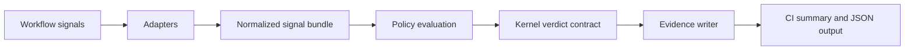

# Architecture

This document describes the planned architecture. Phase 1 implements the
policy-evaluation and evidence-writer layers for the local `evaluate` CLI;
Phase 2 implements the advisory GitHub Action around the same evaluation;
Phase 3 has started with the read-only GitHub check-runs collector. Other
signal adapters remain planned. Sections below that are not yet implemented
are not implementation claims.

## Layers

## Signal adapters

Adapters convert external workflow data into a normalized internal bundle. Early adapters should be read-only and deterministic.

Initial adapter candidates:

- GitHub check suite summary.
- Pull request metadata summary.
- SARIF/code scanning summary.
- OpenSSF Scorecard summary.
- Dependency update summary.
- AI-agent review summary.

Adapters must preserve source identity and enough digest information for replay. They must not silently reinterpret severity, trust, or ownership.

## Policy evaluation

A policy maps normalized signals into gate requirements. The first policy format should be simple YAML or JSON before introducing a heavier policy engine.

Example policy concepts:

- Required checks must be present and successful.
- Missing mandatory evidence blocks the gate.
- Advisory scanner findings may warn but not block.
- Ambiguous or malformed input fails closed.

## Kernel verdict contract

The workflow gate should depend on the public verdict semantics of `aos-kernel`, not on private repository internals. Any future integration must keep a clear distinction between kernel verdict semantics and workflow adapter behavior.

## Evidence writer

The evidence writer emits a stable decision artifact with:

- Subject identity: repository, ref, commit, pull request or release candidate.
- Policy identity: policy id and version or digest.
- Input identity: source ids and digests.
- Verdict: `PASS`, `WARN`, or `BLOCK`.
- Verification status: initially `UNSIGNED_NOT_OFFICIAL`.
- Human-readable summary.

## Security posture

Early releases should run with least privilege, avoid secrets when possible, and treat external workflow data as untrusted input. GitHub Action integration should start in advisory mode and use read-only permissions by default.
