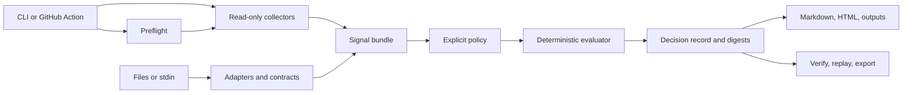

# Architecture

Status: implemented public advisory surface. This document describes the code
that exists in the current package candidate; planned integrations are named
explicitly.

## System boundary

`aos-workflow-gate` is a standalone Python package with zero runtime
dependencies. It shares the `PASS/WARN/BLOCK` verdict vocabulary and design
lineage of `aos-kernel`, but it does not import, execute, or require the
kernel at runtime. This repository owns workflow collection, policy evaluation,
decision records, replay, and presentation.

The kernel's public Lean surface formalizes a numeric interval demonstrator;
it does not prove this package's source-status rules or GitHub semantics.
Kernel and workflow-gate evidence are not interchangeable. Any future
kernel-backed claim requires an explicit shared contract and cross-repository
conformance tests.

## Decision flow

Preflight reports capability and environment diagnostics only. It never emits
a policy verdict. Collection failures stay operational evidence and cannot be
reinterpreted as successful controls.

## Entry surfaces

| Surface | Responsibility |
| --- | --- |
| `preflight` | Probe repository, pull request, rules, checks, statuses, and runtime context without a verdict. |
| `collect`, `import`, `agent-action` | Build or extend normalized evidence from GitHub, files, or stdin. |
| `evaluate` | Apply one explicit policy to one existing bundle. |
| `run` | Collect, evaluate, record, and summarize in one local or Actions flow. |
| `check-pr` | Inspect a public or authorized GitHub PR and compare exact-SHA observations with active branch requirements. |
| `verify`, `summarize`, `export` | Verify records, render deterministic views, and create an unsigned in-toto Statement projection. |
| `bench-verify` | Replay declared benchmark artifacts without arbitrary command execution. |

The zero-config Action invokes the same `run` path as the CLI. Explicit
`required-checks` replaces GitHub requirement discovery; it does not merge
with autodiscovery.

## Collection and identity

Built-in GitHub collection reads active rulesets or classic branch protection,
check runs, workflow runs, check suites, and commit statuses for the exact head
SHA. File adapters currently normalize SARIF 2.1.0 and OpenSSF Scorecard
documents. External integrations use the versioned
[`source-v0` contract](SOURCE_CONTRACT.md).

Three identities remain separate:

- control identity: `(context, integration_id)`;
- requirement provenance: deterministic `required_by[]`;
- observation scope: repository plus exact `head_sha`.

A shared context does not collapse app-bound controls. Provenance can have
multiple rule sources without creating duplicate controls. Subject or
freshness mismatches remain visible evidence.

## Policy evaluation

Policies are operator-controlled JSON or a restricted YAML subset. They define
subject requirements, required and advisory source IDs, rule severities, mode,
and verification status. Sources report observations; they cannot mark
themselves required or issue a verdict.

Evaluation is deterministic and fail-closed for missing or malformed mandatory
evidence. `PASS/WARN/BLOCK` describes policy readiness. Process exit behavior
is separate: advisory returns success for a `BLOCK`; explicit enforcement or
a blocking policy may return exit code 1.

See [Policy Packs](POLICY_PACKS.md) and
[Source Contract](SOURCE_CONTRACT.md).

## Evidence and replay

A decision record binds:

- normalized subject identity;
- policy ID, mode, digest, and verification status;
- source identities and digests;
- canonical input-bundle digest;
- compact observation scope and freshness;
- content-addressed verifier manifest;
- verdict, structured reason codes, and `can_block`;
- self-verifying `record_digest`.

Canonical JSON rejects non-finite numbers. The verifier manifest hashes every
packaged Python module and policy pack after line-ending normalization.
Content addressing detects mutation or verifier substitution; it does not
prove authorship, operator identity, or code correctness.

The JSON record is the source of truth. Markdown, HTML, annotations, Action
outputs, and remediation are deterministic projections. `reason.detail` is
display-only and is never parsed to recover semantics.

## Security posture

GitHub access is read-only. Tokens are environment-only and never written into
evidence. Repository output paths are constrained to the configured workspace.
External files and API responses are untrusted, size- and budget-bounded
inputs. No source checkout is required for zero-config collection, and no code
is uploaded to RafineriaAI.

See [Security Readiness](SECURITY_READINESS.md) for the threat and data model.

## Implementation ownership

The package is split by responsibility: collection, contracts, policy,
evaluation, evidence, and presentation. The CLI wires those modules together;
maintainer research tools under `tools/` do not participate in a merge
verdict. The canonical module and test map is in the
[Development Guide](DEVELOPMENT.md).

## Deferred surfaces

Not implemented: a GitLab API collector or Catalog component, signed
RafineriaAI decisions, hosted policy service, dashboard, telemetry, SBOM
generation, provenance generation, compliance automation, or an LLM verdict
path. The unsigned in-toto Statement export is a projection, not a signed
attestation.
