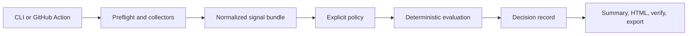

# Development Guide

This is the canonical maintainer onboarding guide. User installation and
operation start in [README.md](../README.md); release rules live in
[RELEASE_GOVERNANCE.md](RELEASE_GOVERNANCE.md).

## Supported development environment

- Python 3.11 is the minimum supported version.
- CI runs the full suite on Python 3.11 and 3.14.
- Git is required for benchmark and compatibility tests.
- Runtime dependencies: none.
- Development dependencies: install `.[dev]`; do not install test tools
  individually.

A clean environment must pass:

```bash
python -m pip install -e ".[dev]"
python -m ruff check .
python -m mypy
python -m pytest
python tools/check_public_surface.py
```

The full suite deliberately builds and installs a wheel with
`--no-build-isolation`. A missing `setuptools` or `wheel` in the active
environment is therefore a setup defect, not a test to skip.

## Decision path



The decision record is the source of truth. Markdown, HTML, Action outputs, and
annotations are deterministic projections of that record.

## Repository map

| Area | Responsibility |
| --- | --- |
| `aos_workflow_gate/cli.py` | Command parser and command orchestration only. |
| `collect.py`, `checkpr.py`, `requirements.py`, `workflow_state.py` | Read-only GitHub collection, exact-SHA requirement identity, and workflow visibility. |
| `preflight.py`, `diagnostics.py` | Capability probes and operational diagnostics; never policy verdicts. |
| `adapters.py`, `source_contract.py`, `agent_action.py` | External evidence normalization and contract validation. |
| `policy.py`, `evaluate.py` | Restricted policy grammar and deterministic `PASS/WARN/BLOCK` semantics. |
| `canonical.py`, `evidence.py`, `manifest.py` | Canonical bytes, digests, records, verifier manifest, and replay integrity. |
| `summarize.py` | Shared diagnosis, one dominant next action, Markdown/HTML rendering. |
| `export.py` | Unsigned in-toto Statement projection. |
| `bench.py`, `benchmarks/` | Offline benchmark verification and committed evidence. |
| `tools/` | Maintainer research and public-surface guards; never part of a merge verdict. |
| `action.yml` | Composite Action wrapper, outputs, advisory/enforce behavior, artifact upload. |
| `docs.json` | Complete index of public documents, evidence, policies, tools, CI, and assets. |

Large orchestration modules are not permission to mix concerns. Put collection,
policy, evidence, and presentation logic in their owning modules and keep the
CLI as wiring.

## Non-negotiable invariants

- The verdict path is deterministic; no LLM participates.
- The same canonical input, policy, and verifier version produce the same
  decision and record digest.
- Observation scope is repository plus exact head SHA.
- Control identity is `(context, integration_id)`; requirement provenance is
  preserved separately.
- Missing, stale, malformed, tampered, or incomplete mandatory evidence cannot
  silently become `PASS`.
- A verdict answers policy readiness. An exit code controls process execution.
- Advisory is the default; enforcement is explicit.
- GitHub access is read-only and tokens never enter evidence.
- Historical records remain replayable; schema evolution needs compatibility
  tests and an explicit migration boundary.
- `UNSIGNED_NOT_OFFICIAL` remains accurate until signing and publication
  controls exist.
- Internal tests are not evidence of external usefulness, precision, adoption,
  retention, incident reduction, or willingness to pay.

## Where to add tests

| Change | Primary tests |
| --- | --- |
| CLI parsing or exit behavior | `tests/test_run.py`, `test_check_pr.py`, or the command-specific test |
| GitHub collection and requirement semantics | `test_collect.py`, `test_requirements.py`, `test_collection_consistency.py` |
| Source or action contracts | `test_source_contract.py`, `test_agent_action.py`, `test_backward_compat.py` |
| Policy or verdict semantics | `test_evaluate.py`, `test_fixtures_replay.py` |
| Diagnosis or rendering | `test_summarize.py`, `test_golden_summaries.py`, `test_html_view.py` |
| Security and failure handling | `test_security_hardening.py`, `test_resilience.py`, `test_zero_trust.py` |
| Benchmarks and claim gates | `test_benchmark_cases.py`, `test_adversarial_corpus.py`, `test_value_gate.py` |
| Packaging or clean-room setup | `test_product_test_readiness.py` |
| Public docs, links, versions, and examples | `test_public_surface.py` and `tools/check_public_surface.py` |

Do not update golden output merely to make a test pass. Review the semantic
change first, then update the fixture in the same PR with its rationale.

## Documentation ownership

Update the narrowest canonical document:

| Change | Canonical document |
| --- | --- |
| First run or top-level value | `README.md` |
| User commands, failures, exit codes | `docs/USER_FAQ.md` |
| Permissions and CI examples | `docs/CI_INTEGRATIONS.md`, `docs/PREFLIGHT.md` |
| Data flow or module boundaries | `docs/ARCHITECTURE.md` |
| Contract or adapter shape | `docs/SOURCE_CONTRACT.md`, `docs/AGENT_ACTION.md`, `docs/ADAPTERS.md` |
| Policy behavior | `docs/POLICY_PACKS.md`, `docs/SCOPE.md` |
| Security or data handling | `SECURITY.md`, `docs/SECURITY_READINESS.md` |
| Release process or public version | `docs/RELEASE_GOVERNANCE.md`, `docs/PUBLISHED_VERSION` |
| Research or product claims | `benchmarks/value/` and the generated assessment |

Add every public document or artifact to `docs.json`. The public-surface guard
rejects missing indexed files, unindexed documents, broken local links, stale
release pins, unsupported claims, and invalid CLI examples.

## Ownership and decisions

[CODEOWNERS](../.github/CODEOWNERS) defines the initial review owner. It is
routing, not a substitute for knowledge transfer. The current single-maintainer
constraint is explicit; replace the user owner with a team as soon as another
maintainer has repository access.

Normal fixes use pull requests. Changes to contracts, canonicalization, verdict
semantics, permissions, security boundaries, release gates, or public claims
need a code-owner decision recorded in the PR. Do not rewrite published tags or
historical evidence.

## Release handoff

Do not publish from a contributor branch. Follow
[Release Governance](RELEASE_GOVERNANCE.md): merge, verify the exact commit,
run the release gate, create an immutable tag, publish evidence, then update the
public version pointer in a follow-up change.

## Troubleshooting

- Recreate `.venv` when switching Python versions.
- Use `python -m ...` so commands run from the active interpreter.
- If wheel installation fails, reinstall `.[dev]`; do not add a global
  dependency or disable the packaging test.
- Run `python tools/check_public_surface.py` after moving or renaming any
  document.
- For GitHub API failures, start with `aos-workflow-gate preflight`; do not
  reinterpret permission or transport failures as policy verdicts.
